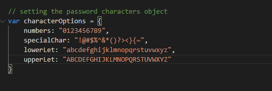
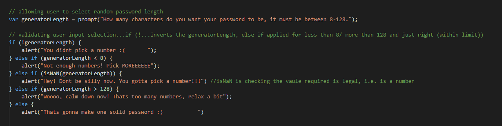
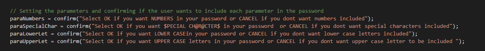
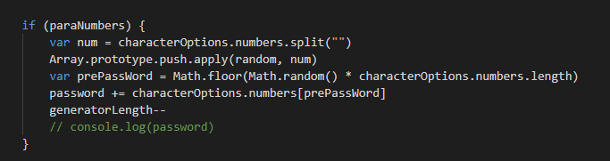
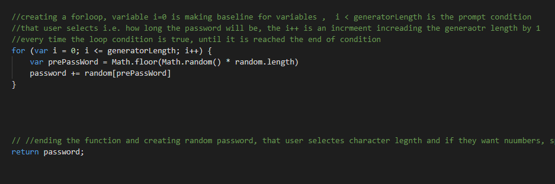

# Create your own web development portfolio landing page

## Description
We were taksed to create a random password generator that a user would be able to decided input elements.

The generator had to allow the user to decide how many characters the password would include (a minumum of 8 and maximum of 128) as well as what character options they wanted to have included (numbers, special characters, lower case and upper case letters). 

This task was a good opportunity to apply fundemental Javascript skills and knowledge we have learnt in recent days.

The task seemed very challening and overwhelming to begin with. But once you stopped and relaised you could do it in smaller sections it became much more bearbale and followed a logical structure. One problem i did have during the project was applying some of the Javascript skills we had learnt, such as pushing certain character options to parameters. I spent a long time figuring this out, but after going over our class actitives and looking at a few web developer websites (MDN Web Docs) i was able to come up with a successful solution. 

One thing i learned from this task is to not become overwhelmed with a big project. It is important to plan out your structure and break it down into smaller steps. And after completting each step to save your work, console.log(XXXX) to check it works and then move forward. I also learnt that sometimes it is important to step away, think about something else and come back to the task with a fresher mindset. 

Similar to previous tasks i learnt the trail and error is a good method for solving problems. If you try one certain way and it dosent work, remove it, and try another way and repeat the process until it is working. 

Overall, i am happy with the outcome of the project. I did find it diffuclt but kept at the task. I am looking forward to further development and learning of JavaScript as it appears to have many functions. 

Here is a link to my deploted application:
https://mjhwest.github.io/Random-Pword-Generator/

## Usage

The first step was to make sure that all the character options the user could select from were identified. 
I did this by creating a variable called characterOpions. 

The next step was to complete the function so the password could be generated. 

This was made up of setting a prompt for the user to identify how long the password should be as well as what would happen  IF the user didnt pick a number, picked a number too short / too long and the correct length. 

The next task was to make sure the parameters were set, i.e what the user wanted the password to be made up of. 

An IF statement was created to generate the password. The same IF statement principles could be applied for each parameter. However, you had to make sure each statement was assosicated with its corresponding parameter. 

Finally, we could creat a for loop. This was made so the password legnth matched the input length selected by the user. After the for loop would meet its criteria the password would be generated. 

